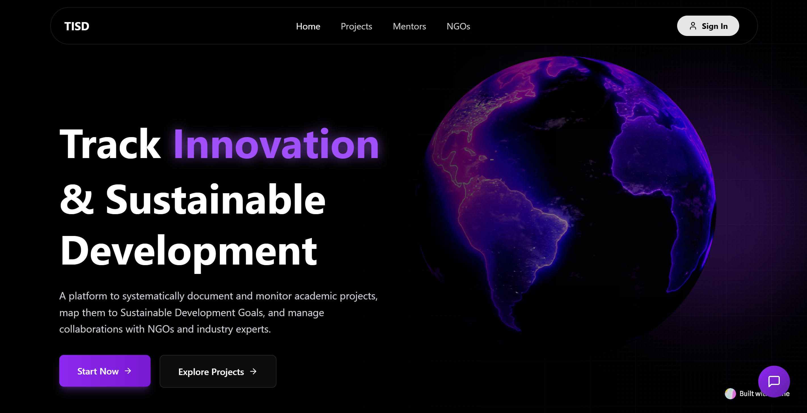

  

<picture>
  <source media="(prefers-color-scheme: dark)" srcset="https://raw.githubusercontent.com/gavin100305/gavin100305/manual-run-output/docker/github-contribution-grid-snake-dark.svg">
  <source media="(prefers-color-scheme: light)" srcset="https://raw.githubusercontent.com/gavin100305/gavin100305/manual-run-output/docker/github-contribution-grid-snake.svg">
  
</picture>

 
 

**I'm a passionate developer** focused on building **scalable and full-stack applications** using **Node.js**, **Python**, and modern web technologies.  

I am also exploring **AI/ML**, integrating intelligent and data-driven features to enhance user experiences. My goal is to continuously expand my skill set and develop applications that are robust, innovative, and future-ready.

 
 

## Technologies & Tools  
## Languages

  
  
  
  

---

## Frontend Development

  
  

---

## Backend Development

  
  
  

---

## Mobile Development

  
  

---

## AI / Machine Learning

  
  
  
  
  
  

---

## Databases

  
  
  

---

## Developer Tools

  
  
  

 

## Featured Projects

<table>
  <tr>
    <td width="50%" style="padding: 15px;" align="center">
      
      <h3>
        <a href="https://github.com/gavin100305/TISD-Website">
          TISD - Tracking Innovation & Sustainable Development
        </a>
      </h3>
      
A comprehensive web platform designed for systematic project tracking, SDG alignment, and institutional collaboration. Features intelligent mentor-student matching, real-time progress monitoring, and advanced analytics powered by Gemini API for generating insightful reports.

    </td>
    <td width="50%" style="padding: 15px;" align="center">
      
      <h3>
        <a href="https://github.com/gavin100305/Neurolytics">
          Neurolytics
        </a>
      </h3>
      
A no-code/low-code research tool that enables researchers to design, deploy, and collect behavioral experiments online. Includes high-precision timing engine, visual experiment builder, secure data handling, and support for audio/voice responses with comprehensive analytics.

    </td>
  </tr>
  <tr style="height: 30px;">
    <td colspan="2"></td>
  </tr>
  <tr>
    <td width="50%" style="padding: 15px;" align="center">
      
      <h3>
        <a href="https://github.com/gavin100305/BitNBuild-25_TeamCotton">
          NourishNet
        </a>
      </h3>
      
A comprehensive food delivery and meal subscription platform connecting customers with local vendors. Built with multi-tiered architecture featuring dedicated applications for customers, vendors, drivers, and administrators with real-time delivery tracking and route optimization.

    </td>
    <td width="50%" style="padding: 15px;" align="center">
      
      <h3>
        <a href="https://github.com/gavin100305/Zenith">
          Zenith
        </a>
      </h3>
      
An AI-driven career platform helping students and job seekers land their dream roles through intelligent upskilling and personalized job matching. Features smart resume parsing, AI interview practice with real-time feedback, skill mapping, and project-based learning recommendations.

    </td>
  </tr>
</table>

 

## GitHub Stats  

  
  

  

 

## Connect with Me

  
  
  

 

  
  
  

